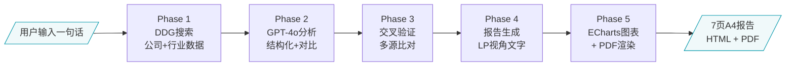

# LP投后汇报报告生成 Agent

输入一句话需求，自动搜索公开数据、LLM结构化分析、交叉验证、生成7页投后汇报报告（HTML + ECharts交互式图表 + PDF）。

## 架构



## 目录结构

```
lp-report/
├── README.md                      # 本文件
├── SKILL.md                       # Agent Skill定义（Claude Code可直接加载）
├── data/
│   ├── input/                     # 用户输入数据
│   │   └── user_response.json    # 用户回复（投资信息、thesis、风险等）
│   └── output/                    # 生成的报告数据（JSON中间产物）
├── modules/                       # 5个Phase执行手册
│   ├── 01-search.md               # Phase 1: DDG搜索策略 + 输出schema
│   ├── 02-analysis.md             # Phase 2: LLM分析 + 同行对比
│   ├── 03-report.md               # Phase 3: LP视角报告文字生成
│   ├── 04-render.md               # Phase 4: ECharts图表 + PDF渲染
│   └── 05-validate.md             # Phase 5: 数据交叉验证
├── references/                    # 参考规范
│   ├── pitchbook-theme.md         # ECharts配色+排版规范（PitchBook风格）
│   ├── lp-writing-guide.md        # LP写作视角转换规范
│   ├── data-sources.md            # 数据来源 + 置信度矩阵
│   └── chart-specs.md             # 图表数据schema
├── report/                        # 报告输出
│   └── report.html                # 7页完整报告（ECharts交互式）
├── scripts/                       # 可执行脚本
│   ├── app.py                     # Flask主应用（SSE进度 + 报告展示 + PDF下载）
│   ├── html2pdf.js                # Puppeteer HTML→PDF（逐页截图方案）
│   └── generate_pdf.py            # reportlab PDF生成（备选方案）
└── pipeline/
    └── index.html                 # 产品首页（输入框 → SSE进度面板 → 下载）
```

## 快速开始

```bash
# 1. 安装依赖
pip install flask

# 2. 启动服务
cd lp-report/scripts
python app.py
# → http://localhost:5010

# 3. 使用
# 打开浏览器，输入"请生成Cerebras芯片行业LP投后汇报报告"
# 等待5个Phase完成 → 查看报告 / 下载PDF
```

## 技术栈

| 组件 | 技术 | 说明 |
|------|------|------|
| 后端 | Flask + SSE | Server-Sent Events实时推送进度 |
| 搜索 | DuckDuckGo | 零成本公开数据采集 |
| LLM | OpenAI GPT-4o | 结构化分析 + 报告文字生成 |
| 图表 | ECharts 5.5 | 交互式柱状图/折线图 |
| PDF | Puppeteer | 逐页截图 → 拼接PDF |
| 部署 | Nginx + Flask | 反向代理，SSE支持 |

## 单次生成费用（OpenAI API）

| 环节 | Token估算 | 费用 |
|------|----------|------|
| 搜索结果结构化 | ~8K input + 2K output | ~$0.05 |
| 同行分析+对比 | ~10K input + 3K output | ~$0.07 |
| 报告文字生成 | ~12K input + 4K output | ~$0.10 |
| 交叉验证 | ~5K input + 1K output | ~$0.01 |
| **合计** | **~35K tokens** | **~$0.23** |

## 报告示例

当前生成的报告以 Cerebras Systems Inc. 为标的，包含7页：

1. 封面 + 基金芯片赛道投资组合（Groq / Cerebras / Photonium）
2. 目录
3. 投资概况与三大投资逻辑兑现追踪
4. 核心经营数据与行业环境（AI芯片市场规模图）
5. 融资历程与IPO进展（融资历程双轴图 + 技术参数表）
6. 风险监控与投后管理
7. 投资结论与关键数据速览

## 线上演示

http://121.40.66.34/lp/

