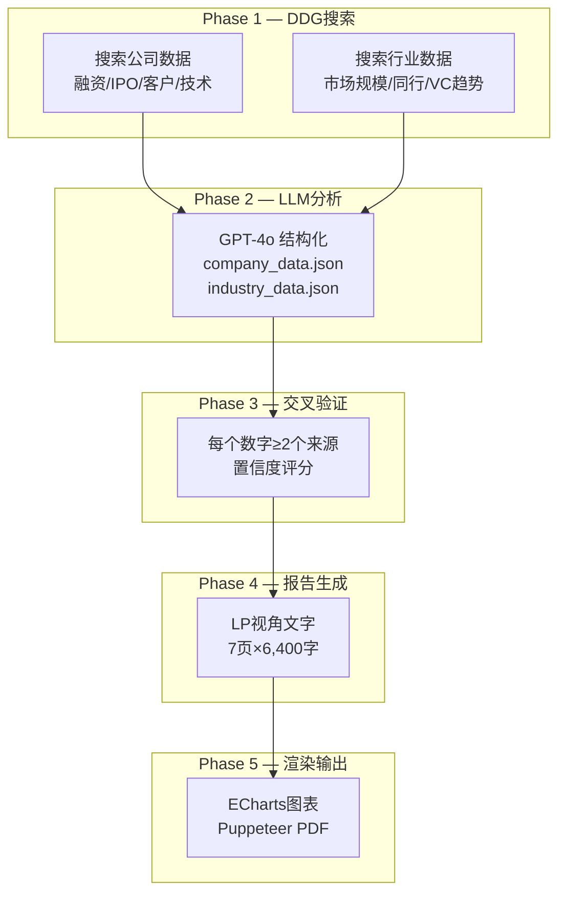

# LP投后汇报报告生成 Agent

输入一句话（如"帮我生成Cerebras投后报告"），自动用DDG搜索公开数据，GPT-4o结构化分析，ECharts渲染图表，输出7页投后汇报HTML+PDF报告。

## When to Use

当用户说"生成LP报告/投后报告/芯片行业报告"时触发。

## 5个Phase流程

## 报告页面结构（7页）

| 页 | 内容 | 数据来源 |
|----|------|--------|
| P1 | 封面 + 基金投资组合一览 | 用户数据 + 公开数据 |
| P2 | 目录 | 自动生成 |
| P3 | 投资概况与投资逻辑兑现（3个thesis） | 用户回复 + LLM分析 |
| P4 | 核心经营数据与行业环境（图表+表格） | DDG搜索 + 10-K |
| P5 | 融资历程与IPO进展（图表+时间线） | Crunchbase + SEC |
| P6 | 风险监控与投后管理 | 用户回复 + LLM |
| P7 | 投资结论与关键数据速览 | 全文汇总 |

## 视觉规范

| 属性 | 值 |
|------|------|
| 主色 | #0096A9（标题、表头、图表主色） |
| 深蓝 | #003D6B（大标题、卡片标题） |
| 薄荷 | #6ECEB2（折线、次要强调） |
| 字体 | Noto Sans SC |
| 图表库 | ECharts 5.5.0 CDN |

## 关键数据校准（已核实）

| 数据项 | 数值 | 来源 |
|--------|------|------|
| AI加速器市场 2024 | 美国~$49B | Bloomberg/IDC |
| NVIDIA FY2026营收 | $215.9B | NVIDIA 10-K |
| Cerebras H1 2024营收 | $136.4M | SEC S-1 |
| Cerebras最新估值 | $23B | Bloomberg+官方PR |
| AMD FY2025营收 | $34.6B | AMD 10-K |

## 搜索引擎

全部使用 DuckDuckGo（零成本），降级链：DDG → WebSearch → Tavily MCP

## Red Flags

- 必须LP视角（不是sell-side pitch）
- 搜索用英文（中文结果质量低）
- 数据不足时标注"数据未获取"，不编造
- 每个数字至少两个来源交叉验证
